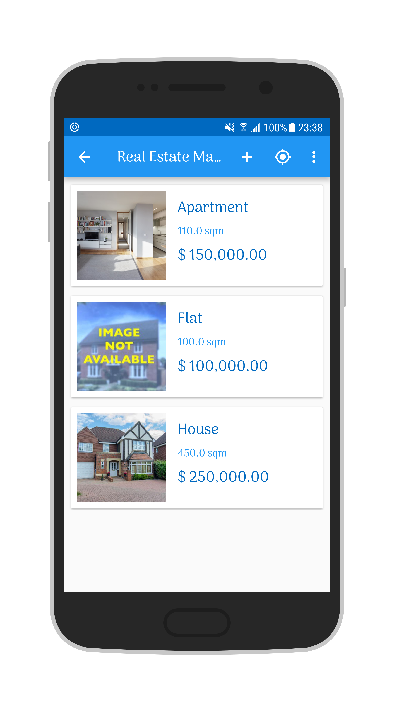

# RealEstateManager
An app to organise real estate listings that uses Android Jetpack Components.

The app allows user registration, creating and editing listings and displaying them in lists. It also allows to show the listings using Google Maps API.

The app incorporates a Loan Simulator as an extra feature.

## Screenshots

&ensp;&ensp;

&ensp;

&ensp;

&ensp;&ensp;

&ensp;&ensp;

&ensp;

&ensp;&ensp;

&ensp;&ensp;

## Libraries

* [ButterKnife](https://github.com/JakeWharton/butterknife/)
* [Android Support Library](https://developer.android.com/topic/libraries/support-library/)
* [Glide](https://github.com/bumptech/glide/)
* [Google Maps Platform](https://cloud.google.com/maps-platform/) 
* [Retrofit](https://github.com/square/retrofit/)
* [Retrofit Converter Gson](https://github.com/google/gson)
* [RxJava 2 - Retrofit Adapter](https://github.com/square/retrofit/tree/master/retrofit-adapters/rxjava2)
* [RxJava - Room](https://medium.com/google-developers/room-rxjava-acb0cd4f3757)
* [RxBinding](https://github.com/JakeWharton/RxBinding)
* [Gson](https://github.com/google/gson/)
* [RxJava](https://github.com/ReactiveX/RxJava)
* [RxAndroid](https://github.com/ReactiveX/RxAndroid)
* [Room](https://developer.android.com/topic/libraries/architecture/room)
* [ViewModel](https://developer.android.com/topic/libraries/architecture/viewmodel)
* [LiveData](https://developer.android.com/topic/libraries/architecture/livedata)
* [Android-Storage](https://github.com/sromku/android-storage)
* [Android Debug Database](https://github.com/amitshekhariitbhu/Android-Debug-Database)

## Developed By

Diego Fajardo

    Copyright 2018 Diego Fajardo
    
    Licensed under the Apache License, Version 2.0 (the "License");
    you may not use this file except in compliance with the License.
    You may obtain a copy of the License at

        http://www.apache.org/licenses/LICENSE-2.0

    Unless required by applicable law or agreed to in writing, software
    distributed under the License is distributed on an "AS IS" BASIS,
    WITHOUT WARRANTIES OR CONDITIONS OF ANY KIND, either express or implied.
    See the License for the specific language governing permissions and
    limitations under the License.
